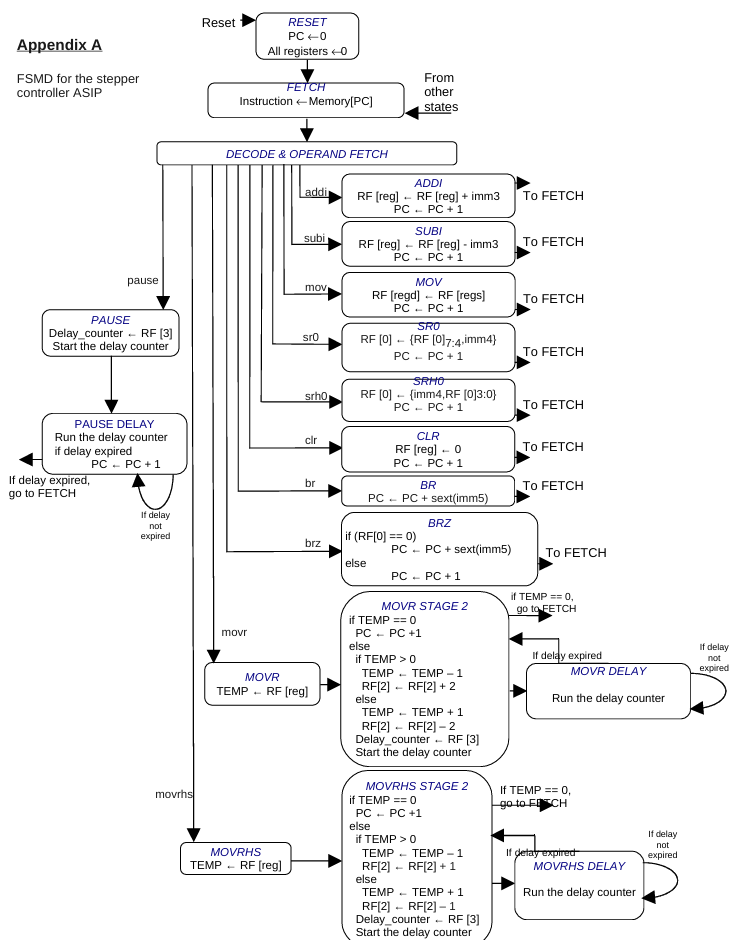

# ASIP Stepper Motor Controller

## Overview
This project implements an Application-Specific Instruction-set Processor (ASIP) designed to control a stepper motor using a custom 8-bit RISC instruction set. The processor architecture includes a datapath, control logic, and a set of tailored instructions optimized for stepper motor operations.

## Features
- Custom 8-bit RISC instruction set tailored for motor control  
- Modular datapath design (ALU, registers, control unit)  
- Instruction execution for step/direction control  
- Simulation support

## Instruction Set
The processor supports a small, efficient instruction set tailored to stepper motor control. Instructions are passed through the datapath and executed in a single-cycle fashion.

The instruction encoding is as follows:

## Datapath Architecture

The controller uses a hardwired finite-state machine to manage instruction sequencing and execution. The FSM has distinct states for:

1. **RESET**: Initializes PC and clears all registers.
2. **FETCH**: Loads the instruction from memory.
3. **DECODE & OPERAND FETCH**: Decodes opcode and fetches operands.
4. **EXECUTE**: Executes arithmetic/logic/motor control logic.
5. **WRITEBACK / CONTROL**: Updates register file or stepper motor output.
6. **BRANCH / DELAY**: Handles conditional branching and delay counter execution for timing-sensitive instructions.

Special attention is given to multi-cycle instructions like `MOVR` and `MOVRHS`, which execute over multiple FSM states, update the TEMP register, and conditionally start the delay counter. 

