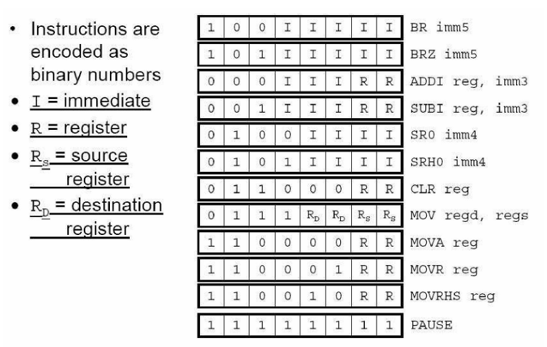

# ASIP Stepper Motor Controller

## Overview
This project implements an Application-Specific Instruction-set Processor (ASIP) designed to control a stepper motor using a custom 8-bit RISC instruction set. The processor architecture includes a datapath, control logic, and a set of tailored instructions optimized for stepper motor operations.

## Features
- Custom 8-bit RISC instruction set tailored for motor control  
- Modular datapath design (ALU, registers, control unit)  
- Instruction execution for step/direction control  
- Simulation support

## Instruction Set
The processor supports a small, efficient instruction set tailored to stepper motor control. Instructions are passed through the datapath and executed in a single-cycle fashion.

The instruction encoding is as follows:

